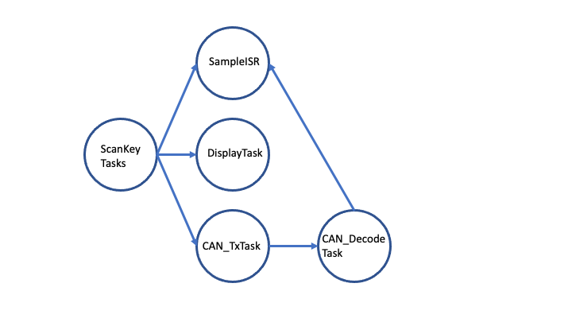

# 1. Embedded System Coursework 2 - Group Hex Future


- [1. Embedded System Coursework 2 - Group Hex Future](#1-embedded-system-coursework-2---group-hex-future)
  - [## 1.1. Core Functionality and Specifications](#-11-core-functionality-and-specifications)
  - [## 1.2. Identification and Summarisation of Tasks](#-12-identification-and-summarisation-of-tasks)
  - [## 1.3. Critical Time Analysis with Initiation Intervals and Execution Time with Quantification of CPU Utilisation](#-13-critical-time-analysis-with-initiation-intervals-and-execution-time-with-quantification-of-cpu-utilisation)
  - [## 1.4. Shared Data Structures and Methods for Safe Access & Synchronisation](#-14-shared-data-structures-and-methods-for-safe-access--synchronisation)
  - [## 1.5 Analysis of inter-task blocking dependencies](#-15-analysis-of-inter-task-blocking-dependencies)
- [Advanced Features](#advanced-features)
  - [## 2.1 Low & High Pass Filter](#-21-low--high-pass-filter)
  - [## 2.2 Reverb](#-22-reverb)
  - [## 2.3 Polyphony with Stereo Sound](#-23-polyphony-with-stereo-sound)
  - [## 2.4 Keyboard Auto-Detect through Handshake Signals](#-24-keyboard-auto-detect-through-handshake-signals)
  - [## 2.5 CAN Communication Messages](#-25-can-communication-messages)
  - [## 2.6 Intuitive Distributed User Interface](#-26-intuitive-distributed-user-interface)
  - [## 2.6 Waveform Selection](#-26-waveform-selection)
  - [## 2.7 Pre-Programmed Music](#-27-pre-programmed-music)
  - [## 3. Appreciation & Reflection](#-3-appreciation--reflection)

## 1.1. Core Functionality and Specifications
--------------------------------------

The following section will descript the core functionality requested by the specification document.

[](https://youtu.be/liQCLkLKoVk/)


URL: https://youtu.be/liQCLkLKoVk

<br />

## 1.2. Identification and Summarisation of Tasks
--------------------------------------

<b>SampleISR</b>:  Produce notes in different waveforms in response to different key press
<br />
<b>PlayMusic</b>: Play pre-programmed music note when designated knob is pressed
<br />
<b>CAN_DecodeTask</b>: Decode messages related CAN communication for transimission purpose
<br />
<b>CAN_TxTask</b>: Transmit CAN bus messages for playing and ending a note
<br />
<b>DisplayTask</b>: Display information about music synthesiser setting in real-time
<br />
<b>ScanKeysTask</b>: Read any changes in inputs and update the variables in the software

<br />
Overall, <b>1 interrupt and 5 threads</b> are used for the music synthesiser. Table 1 below summarise the tasks with type and priority.

<br />
<center>

| Tasks          |   Types   | Priority |
| :------------- | :-------: | :------: |
| SampleISR      | Interrupt | Highest  |
| ScanKeysTask   |  Thread   |    1     |
| DisplayTask    |  Thread   |    2     |
| CAN_DecodeTask |  Thread   |    3     |
| CAN_TxTask     |  Thread   |    4     |

Table 1: Summary of Tasks with Types and Priority
</center>

<br />

## 1.3. Critical Time Analysis with Initiation Intervals and Execution Time with Quantification of CPU Utilisation
--------------------------------------
<center>

| Tasks          | Execution Time, $T_i$ | Initiation Interval, $\tau_i$ | $[\frac{\tau_n}{\tau_i}]T_i$ | $[\frac{T_i}{\tau_i}]$ |
| :------------- | :-------------------: | :---------------------------: | :--------------------------: | :--------------------: |
| SampleISR      |         13 μs         |           45.45 μs            |           28.6 ms            |         28.6%          |
| CAN_DecodeTask |         16 μs         |             25 ms             |           0.064 ms           |         0.064%         |
| CAN_TxTask     |         21 μs         |             30 ms             |           0.07 ms            |         0.07%          |
| DisplayTask    |        18.5 ms        |      $\tau_n$ =  100 ms       |           18.5 ms            |         18.5%          |
| ScanKeysTask   |         73 μs         |             50 ms             |           0.146 ms           |         0.146%         |
|                |                       |             Total             |     47.38 ms < $\tau_n$      |         47.38%         |

Table 2: Critical Time Analysis of Tasks with CPU Utilisation Results

</center>

<br />

In Table 2, it is observed that CAN_DecodeTask, CAN_TxTask and ScanKeysTask utilise very little CPU resource in this music synthesiser. As a result, these 3 tasks have insignificant influence to rate monotonic scheduler. 

To analyse further, since SampleISR is required to be called for 13 μs for every 45.45 initiation interval. Therefore, SampleISR took up 28.6% of CPU with only 71.6% left to be used for more significant task like DisplayTask. In this case, 18.5% is used for DisplayTask with approximately 50% of CPU left unused. This means that deadline will be met under worst case condition in our design. To further improve our design, more threads can be created to handle different tasks as well as queues to buffer messages.

To conclude, the results is sensible where SampleISR takes up more CPU resources since SampleISR is executed very frequently.

<br />

## 1.4. Shared Data Structures and Methods for Safe Access & Synchronisation
--------------------------------------
We defined various global variables and used many methods to guarantee safe access and syn- chronization. Volatile arrays (such as the keyArray, globalkeyArray and serialkeyArray) that are shared by multiple threads are protected using mutexs; volatile integers and other smaller types (such as the knob rotation counter, status indicator and etc.) are protected using atomic stores and loads; dynamic objects (such as the knob decoder class) are protected by enforcing into reentrant member functions. Information that are passed between tasks are guarded by queues.
For examplem the Table below shows the number of shared data structures in each task. Sam- pleISR only reads the data and as an interrupt it cannot be interrupted by anything else; therefore, no methods are applied. Data structures like globalkeypressed[12] which indicate the key-press sta- tus for each key (for polyphony purposes) are guarded by mutex since they can be accessed by both ScankeyTask and DisplayTask. As another example, knob0_pressed, which is a bool vari- able indicating whether knob0 has been pushed, is guarded by using atomic loads and stores in Playmusic and ScanKeyTask.

<center>

| Tasks          | Number of Shared Data Structure | Usage | Methods of Safe Guard |
| :------------- | :-----------------------------: | :---: | :-------------------: |
| SampleISR      |                                 |       |                       |
| CAN_DecodeTask |                                 |       |                       |
| CAN_TxTask     |                                 |       |                       |
| DisplayTask    |                                 |       |                       |
| ScanKeysTask   |                                 |       |                       |

Table 3: Summary of Shared Data Structure and Methods of Safe Guard

</center>

<br />

## 1.5 Analysis of inter-task blocking dependencies
--------------------------------------

We use mutex and atomic processes to prevent the global variables being accessed by other tasks when read/ writen by a task. Dependencies are anything that can cause a task to block. Inter-task blocking dependencies happen when a thread need to read or write a global variable that is also accessed by another thread. Therefore, we need to consider the dependencies of all tasks and ensure that there's no cycles in the dependency graph, which can lead to deadlock.

For Example, SampleISR and ScanKeyTask have inter-task dependencies because they all access some common global variables. SampleISR waits ScanKeyTask to update the filter_mode to know whether it should output a Vout that is filtered or not. Also, it needs to wait for ScanKeyTask to set the keypressed variable to know which note to play.

Another example is that CAN_TxTask needs to wait for ScanKeyTasks to write the volume value. CAN_TxTask reads the value and transmits it. Another board's CAN_DecodeTask thread then recieves the value and decodes it. Then, the SampleISR thread on the other board uses the decoded value to output the correct volume. This way, we can adjust the settings on all boards using only the controls of one board.

We do not have the risk of deadlock because our dependency graph does not have 1-direction closed cycle. 



# Advanced Features


## 2.1 Low & High Pass Filter
--------------------------------------
To enable music note manipulation, Low Pass and High Pass Filtering of music signal are implemented. 

**Pressing** **of** **Knob** **0**: To switch between **No Filter (NONE), Low Pass Filter (LPF), High Pass Filter (HPF)**.
<br />
**Turning of Knob 0**: To adjust the intensity of different filtering ranging from 0-9

```C++
const uint8_t lpf[10][12] = {
{10,10,10,10,10,10,10,10,10,9,8,7}
,{10,10,10,10,10,10,10,10,9,8,7,6}
,{10,10,10,10,10,10,10,9,8,7,6,5}
,{10,10,10,10,10,10,9,8,7,6,5,4}
,{10,10,10,10,10,9,8,7,6,5,4,3}
,{10,10,10,10,9,8,7,6,5,4,3,2}
,{10,10,10,9,8,7,6,5,4,3,2,1}
,{10,10,9,8,7,6,5,4,3,2,1,1}
,{10,9,8,7,6,5,4,3,2,1,1,1}
,{9,8,7,6,5,4,3,2,1,1,1,1}
};

const uint8_t hpf[10][12] = {
{7,8,9,10,10,10,10,10,10,10,10,10}
,{6,7,8,9,10,10,10,10,10,10,10,10}
,{5,6,7,8,9,10,10,10,10,10,10,10}
,{4,5,6,7,8,9,10,10,10,10,10,10}
,{3,4,5,6,7,8,9,10,10,10,10,10}
,{2,3,4,5,6,7,8,9,10,10,10,10}
,{1,2,3,4,5,6,7,8,9,10,10,10}
,{1,1,2,3,4,5,6,7,8,9,10,10}
,{1,1,1,2,3,4,5,6,7,8,9,10}
,{1,1,1,1,2,3,4,5,6,7,8,9}
};
```


## 2.2 Reverb
--------------------------------------

Reverb is the effect where a sound seems to be produced in a room. Reverb is created using an array of size 51 to store previous Vout values. By replaying 3 elements of the array at different volume with the current Vout value, we can emulate the sound reflection in a room.

```C++
//*******   Reverb  ***********
if(reverb_switch == 1){
    VoutReverb[0] = Vout;
    for(uint8_t i=50; i>0; i--){
        VoutReverb[i] = VoutReverb[i-1];
    }
    Vout = Vout+VoutReverb[45]*0.7+VoutReverb[35]*0.5+VoutReverb[20]*0.2;
}
//*******   Reverb  ***********
```

The part of code is implemented within **SampleISR()** function and is adapted for different waveforms such as SawTooth, Triangular and Square.


## 2.3 Polyphony with Stereo Sound
--------------------------------------
Polyphony, in music, is the simultaneous combination of two or more tones. In our music synthesiser, the sound of music notes will be produced respectively by the speakers of corresponding board where the keys are pressed. This enables polyphony with Stereo Sound where combination of music notes are much more similar to real piano.

Clipping of speaker is avoided using Stereo Sound system. Having notes played from different speakers allows a larger number of notes to be played at the same time without clipping. 

## 2.4 Keyboard Auto-Detect through Handshake Signals
--------------------------------------
When west detect or east detect bit changed, the board would notice that the overall board arrangement has changed. The board on the left will always initiate a handshake. For example, 1 board extens to 2, the board on the left would initiate the handshake. 2 boards extends to 3 boards, the second board would initiate the handshake to inform others its existance. Since the left board always initiate the handshake, only the board on the right would accept this message. This is done by assigning the second bit in the handshake message as the boards' position (range from 1 to 3). After handshake, each board would know its accurate position in the overall board arrangement. 

## 2.5 CAN Communication Messages
--------------------------------------
1. Handshake 
    The main purpose of handshake is to inform others its location, octave, and volume 
    //CODE here 

2. Configuration Change
    Message contains:
    1. board location (for future use)
    2. octave
    3. volume 
    4. waveform_mode
    5. reverb_switch
    //CODE here
Each time when octave/volume/waveform/reverb changed in the leading board a CAN message starting with 'C' would be broadcast to the network. Since each board knows its location, they would adjust their octave based on their location. 

3. Pressed Message 
    All the pressed keys will be displayed in the second board if there is one. The message would contain sender's board_location and keys pressed. The 12 keys are represented in a 12 bit number that stored in the third and fourth byte in the TX message. The second board would derive each key's ocatve based on the sender's board location 
    // CODE here

How functionality switches are transmiitted? \
Functionality switches
How values of different functionalities are transmitted? \
How are notes, octave transmitted. 


## 2.6 Intuitive Distributed User Interface
--------------------------------------
When multiple boards are connected together, the left-most module becomes the main display, showing whether certain functionalities are on or off. When two boards are connected, the second board from the left recieves all the pressed notes information from the other board(s). The seoncd board module from the left becomes the secondary display, showing all notes played on all modules at their respective octaves. If all three modules are connnected, the right-most module's display is not used. 

Via CAN bus, when the knobs are pressed or rotated on the left-most board. Functionalities like reverb can be turned on or off. Also, the volume or the octave can be changes on the main board. The information will be trainsmitted to the other boards via CAN messages. Therefore, the settings of all three modules can be changed on a single board.

## 2.6 Waveform Selection
--------------------------------------

Waveforms such as Square and Triangle waves are implemented in addition to Sawtooth wave. All of these waves are defined by mathematical function that is written in code.

**Turning of Knob 1**: To select different waveforms

```C++
void sampleISR(){...}
```
<details>
<summary>Click to view "Waveform Implementation in sampleISR()" </summary>

```C++
void sampleISR()
{
    int32_t Vout = 0;
    if(waveform_mode == 0){ //generate sawtooth wave
        if(filter_mode == 2){
            for (uint8_t i=0;i<keypressed_pointer;i++){
                phaseAcc[i] += (currentStepSize[i]*195225/10)*hpf[var0][keypressed[i]];
            }
        }else if(filter_mode == 1){
            for (uint8_t i=0;i<keypressed_pointer;i++){
                phaseAcc[i] += (currentStepSize[i]*195225/10)*lpf[var0][keypressed[i]];
            }
        }
        else{
            for (uint8_t i=0;i<keypressed_pointer;i++){
                phaseAcc[i] += (currentStepSize[i]*195225);
            }
        }
        
        for (uint8_t i=0;i<keypressed_pointer;i++){
            Vout += (phaseAcc[i] >> 24);
        }
        Vout = Vout >> (8 - int(volume) / 2);  

        //*******   Reverb  ***********
        if(reverb_switch == 1){
            VoutReverb[0] = Vout;
            for(uint8_t i=50; i>0; i--){
                VoutReverb[i] = VoutReverb[i-1];
            }
            Vout = Vout+VoutReverb[45]*0.7+VoutReverb[35]*0.5+VoutReverb[20]*0.2;
        }
        //*******   Reverb  ***********
        analogWrite(OUTR_PIN, Vout + 128);

    }else if(waveform_mode == 1){ //generate triangular wave

        if (filter_mode == 2){
            for (uint8_t i = 0; i < keypressed_pointer; i++){
                phaseAcc[i] += (currentStepSize[i] * 195225 / 10) * hpf[var0][keypressed[i]];
            }
        }
        else if (filter_mode == 1){
            for (uint8_t i = 0; i < keypressed_pointer; i++){
                phaseAcc[i] += (currentStepSize[i] * 195225 / 10) * lpf[var0][keypressed[i]];
            }
        }
        else{
            for (uint8_t i = 0; i < keypressed_pointer; i++){
                phaseAcc[i] += (currentStepSize[i] * 195225);
            }
        }
        for (uint8_t i = 0; i < keypressed_pointer; i++){
            Vout += (phaseAcc[i] >> 24);
        }

        if (Vout < 0){
            Vout = 128 + (Vout >> (8 - int(volume) / 2)) *4;
        }
        else{
            Vout = 127 - (Vout >> (8 - int(volume) / 2)) *4;
        }

        //*******   Reverb  ***********
        if(reverb_switch == 1){
            VoutReverb[0] = Vout;
            for(uint8_t i=50; i>0; i--){
                VoutReverb[i] = VoutReverb[i-1];
            }
            Vout = Vout+VoutReverb[45]*0.7+VoutReverb[35]*0.5+VoutReverb[20]*0.2;
        }
        //*******   Reverb  ***********
        analogWrite(OUTR_PIN, Vout);

    }else if(waveform_mode == 2){ //generate square wave
        if (filter_mode == 2){
            for (uint8_t i = 0; i < keypressed_pointer; i++){
                phaseAcc[i] += (currentStepSize[i] * 195225 / 10) * hpf[var0][keypressed[i]];
            }
        }
        else if (filter_mode == 1){
            for (uint8_t i = 0; i < keypressed_pointer; i++){
                phaseAcc[i] += (currentStepSize[i] * 195225 / 10) * lpf[var0][keypressed[i]];
            }
        }
        else{
            for (uint8_t i = 0; i < keypressed_pointer; i++){
                phaseAcc[i] += (currentStepSize[i] * 195225);
            }
        }
        int32_t Vout_intermediate = 0;
        for (uint8_t i = 0; i < keypressed_pointer; i++){
            Vout_intermediate += (phaseAcc[i] >> 24);
        }
        Vout_intermediate = Vout_intermediate >> (8 - int(volume) / 2);
        if (Vout_intermediate > 0){
            Vout = INT32_MAX >> 24;
            Vout = Vout >> (8 - int(volume) / 2);
        }
        else{
            Vout = INT32_MIN >> 24;
            Vout = Vout >> (8 - int(volume) / 2);
        }

        //*******   Reverb  ***********
        if(reverb_switch == 1){
            VoutReverb[0] = Vout;
            for(uint8_t i=50; i>0; i--){
                VoutReverb[i] = VoutReverb[i-1];
            }
            Vout = Vout+VoutReverb[45]*0.7+VoutReverb[35]*0.5+VoutReverb[20]*0.2;
        }
        //*******   Reverb  ***********
        analogWrite(OUTR_PIN, Vout + 128);
    }

}
```
</details>

<br />

## 2.7 Pre-Programmed Music 
--------------------------------------

Twinkle Twinkle Little Star are programmed into Knob 3 where play music functionality is a thread by itself.


**Pressing of Knob 3**: To play Twinkle Twinkle Little Star


## 3. Appreciation & Reflection
--------------------------------------

